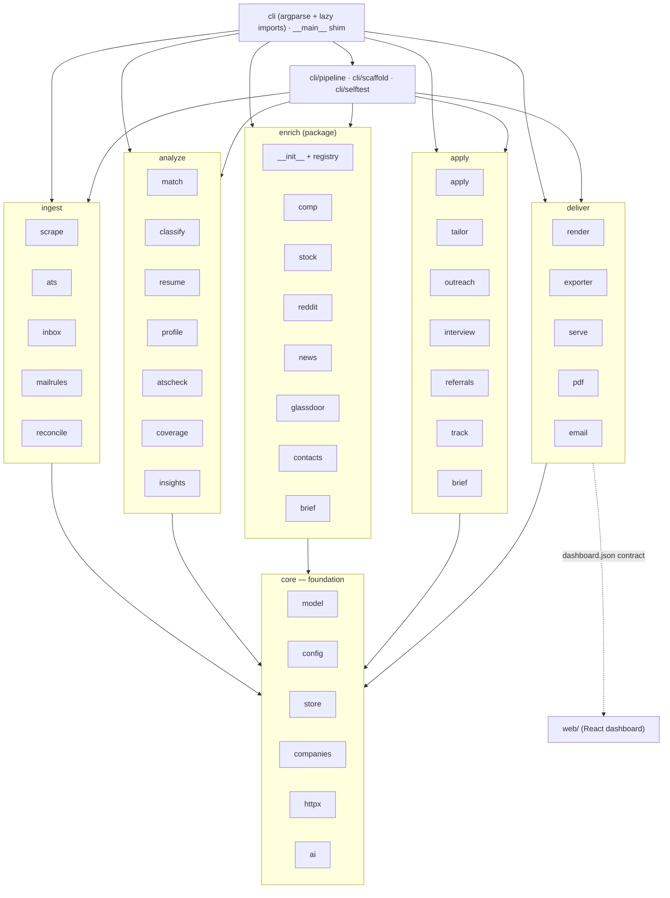
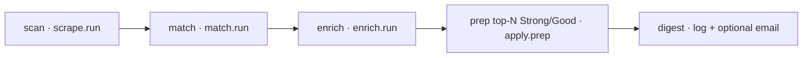
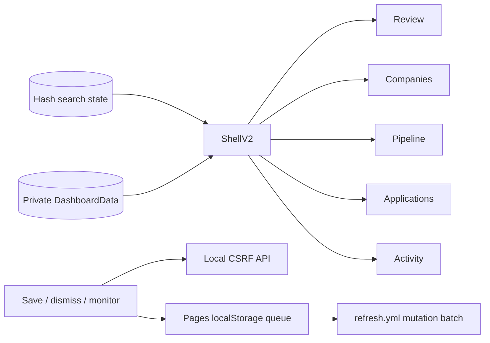
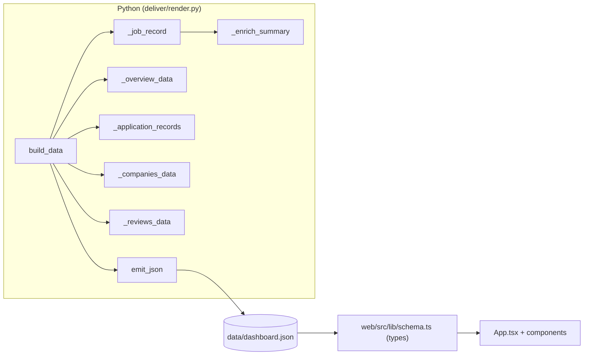

# jobscope — Architecture & Code Map

> A resume-driven job scout, enricher, and application-prep tool.
> **Deterministic-first, offline-first, AI-optional** — the core 80% (scoring, filtering,
> parsing, persistence) runs with no network and no API key; AI and network calls are
> optional upgrades that degrade gracefully.

This document is the living map of the codebase: what each module does, how they depend
on each other, the Python↔TypeScript data contract, and the modular sub-package
structure the codebase has settled into. Keep it current (see
[Keeping this doc current](#keeping-this-doc-current)).

---

## 1. Design philosophy

| Principle | What it means in code |
|-----------|-----------------------|
| **Deterministic-first** | `match`, `resume`, `mailrules`, `companies` are pure functions — no network, no LLM. Same input → same output. |
| **Offline-first** | Base layers have zero third-party network deps; scrapers/enrichers are best-effort and never break a run. |
| **AI-optional** | `ai.chat()` returns `None` when disabled; every AI caller has a deterministic fallback. The optional quorum backend accepts per-call `strategy`, `history`, and grounding `context` without changing the deterministic path. |
| **Additive persistence** | `store` upgrades old databases in place via `ALTER TABLE ADD COLUMN`; never a destructive migration. |
| **Best-effort enrichment** | Each enrich source is isolated; one failure is caught and does not stop the others. |

---

## 2. Repository layout

```
jobscope/
  jobscope/          Python package (the CLI + all logic)
    core/            Foundation: model, config, store/ (pkg), companies, httpx, ai
    ingest/          Acquire jobs & signals: scrape, ats, inbox, mailrules, reconcile
    analyze/         Deterministic core: match/ (pkg), classify, resume, profile, atscheck, coverage, insights
    enrich/          Best-effort intel (one module per source) + registry
    apply/           Tailor & submit: apply, tailor, outreach, interview, referrals, track, brief
    deliver/         Dashboards & exports: render, exporter, serve, pdf, email, schema/
    cli/             build_parser + cmd_* + main (+ pipeline, scaffold, selftest)
    __main__.py      Thin shim → cli.main (console-script + `python -m jobscope`)
  web/               Vite + React + TS dashboard (consumes the JSON contract; PWA/Pages UI)
    src/
  scripts/           Publish helpers, encrypted-apps template, cloud-refresh crypt/seed (crypt-file.mjs, seed-cloud-db.ps1)
  .github/           workflows/refresh.yml — cloud auto-refresh (scan Gmail + republish; encrypted DB on the `data` branch)
  tests/             pytest suite (offline; mirrors the module layout)
  data/              Runtime artifacts (SQLite db, dashboard json) — gitignored
  ARCHITECTURE.md    This file
  pyproject.toml     setuptools; console-script `jobscope`; find = ["jobscope*"]
```

---

## 3. Layered architecture

Modules live in concern sub-packages under `jobscope/` (`core`, `ingest`, `analyze`,
`enrich`, `apply`, `deliver`, `cli`); each group below is a real package on disk (see
[§2](#2-repository-layout)). This layered shape is the one the reorg landed on (see
[Modularity roadmap](#12-modularity-roadmap)).



**Purely dependency-free modules** (no internal imports — the stable bedrock):
`model`, `config`, `companies`, `httpx`, `mailrules`, plus the leaf enrich sources
(`comp`, `stock`, `reddit`, `news`, `glassdoor`). `store` depends only on `model`;
`ai` only on `config`. **No circular imports exist anywhere.**

---

## 4. Backend module inventory

LOC are exact (source lines incl. comments). Grouped by concern (= sub-package on disk).

### core — foundation (pure/near-pure, highest fan-in)

| Module | LOC | Responsibility | Internal imports | Key exports |
|--------|-----|----------------|------------------|-------------|
| [model.py](jobscope/core/model.py) | 228 | Core dataclasses + id/slug helpers | — | `Job`, `Resume`, `Application`, `Contact`, `MailEvent`, `job_id()`, `slugify()`, `derive_remote_scope()` |
| [config.py](jobscope/core/config.py) | 200 | Load YAML/JSON, deep-merge over `DEFAULT_CONFIG`, env-only secrets, AI/quorum strategy defaults | — | `DEFAULT_CONFIG`, `load_config()`, `api_key()`, `smtp_password()`, `inbox_password()` |
| [store/](jobscope/core/store/) | — | SQLite persistence + additive migrations, including `company_monitors`, monitor↔job provenance, and durable job reviews; concern mixins compose behind `Store` | model | `Store`, `now_iso()` |
| [companies.py](jobscope/core/companies.py) | 128 | Curated prestige/size/funding tiers (deterministic) | — | `company_quality()`, `company_size()`, `company_funding()` |
| [httpx.py](jobscope/core/httpx.py) | 37 | Thin `requests` wrapper (UA, timeout, JSON) | — | `get()`, `get_json()`, `get_text()` |
| [ai.py](jobscope/core/ai.py) | 105 | OpenAI-compatible chat (Groq/Ollama) + optional quorum delegation with per-call strategy/history/context; bridges the keychain-resolved key into the environment for embedded quorum | config | `available()`, `strategy_for()`, `chat()` |

### ingest — acquire jobs & signals

| Module | LOC | Responsibility | Internal imports | Key exports |
|--------|-----|----------------|------------------|-------------|
| [scrape.py](jobscope/ingest/scrape.py) | — | Cadence-gated broad JobSpy discovery; monitored sources are a separate mode | model, store | `run()`, `discovery_due()` |
| [ats.py](jobscope/ingest/ats.py) | — | Typed Greenhouse/Lever/Ashby resolution, career-URL parsing, and board fetch | httpx, model | `resolve_board_result()`, `fetch_company_result()` |
| [monitor.py](jobscope/ingest/monitor.py) | — | Seed/resolve/scan persistent company monitors; health + fail-closed reconciliation | ats, review, store | `seed_monitors()`, `scan_active_monitors()` |
| [inbox.py](jobscope/ingest/inbox.py) | 402 | Gmail IMAP sync (read-only, incremental) → weighted classify (+ optional quorum tie-break) → `mail_events`; drops transactional/OTP mail; `--reclassify` offline repair; recomputes the funnel after each sync | ats, config, model, store, mailrules, reconcile, (ai lazy) | `run()` |
| [mailrules.py](jobscope/ingest/mailrules.py) | 643 | Deterministic **weighted-keyword** email classification (smart-quote-normalized scoring + ambiguity flag) + transactional/OTP detection + company/role parsing (pure, no I/O) | — | `classify_signal()`, `classify_scored()`, `is_job_related()`, `is_transactional()`, `parse_company_role()`, `signal_to_status()`, `advance_status()`, `normalize_company()` |
| [reconcile.py](jobscope/ingest/reconcile.py) | 170 | Rebuild the funnel from the mail timeline — instance-split (reapply / concurrent roles) + conservative reclassify (drop OTP, downgrade false interview/assessment) | model, store, mailrules | `recompute()`, `reclassify()`, `split_instances()` |

### analyze — the deterministic core

| Module | LOC | Responsibility | Internal imports | Key exports |
|--------|-----|----------------|------------------|-------------|
| [match/](jobscope/analyze/match/) | 670 | **Package** — transparent fit scoring, tiers, filters, resume routing; split into `seniority`/`experience`/`filters`/`scoring`/`routing`/`run` submodules (all public + private names re-exported) | model, resume, (companies lazy) | `score_job()`, `apply_filters()`, `select_base()`, `run()`, `SENIORITY_RANK` |
| [classify.py](jobscope/analyze/classify.py) | 61 | Optional AI/quorum seniority + discipline tie-breaker, routed through the classify strategy | ai, match, model | `classify_seniority()` |
| [resume.py](jobscope/analyze/resume.py) | 345 | Parse Markdown/JSON-Resume/PDF/text → `Resume` + skills; seeds the search profile on first import | match, model, (profile lazy) | `import_resume()`, `parse_resume()`, `SKILL_LEXICON` |
| [profile.py](jobscope/analyze/profile.py) | 201 | Résumé-derived editable **search profile** (`data/profile.yaml`) that drives `scan` | model, resume | `build_profile()`, `load()`, `ensure_seeded()`, `apply_to_search()`, `run()` |
| [atscheck.py](jobscope/analyze/atscheck.py) | 217 | Deterministic **ATS parse check** — extracted fields + friendliness score + formatting warnings (+ optional JD keyword coverage) | model, (tailor lazy) | `ats_report()`, `coverage()`, `run()` |
| [coverage.py](jobscope/analyze/coverage.py) | 324 | Per-requirement JD↔résumé coverage (deterministic + optional AI); requirement extraction (perk/mission filtered) | model, resume, (tailor/ai lazy) | `coverage_report()`, `extract_requirements()`, `run()` |
| [insights.py](jobscope/analyze/insights.py) | 47 | Skill-gap analysis across matched jobs | resume, store | `skill_gap()`, `run()` |

### enrich — best-effort public intel (`enrich/` package)

| Module | LOC | Responsibility | Internal imports |
|--------|-----|----------------|------------------|
| [enrich/__init__.py](jobscope/enrich/__init__.py) | 78 | Per-company coordinator — iterates the source registry (toggles each by config) | registry, comp, stock, reddit, news, glassdoor, brief, contacts |
| [enrich/registry.py](jobscope/enrich/registry.py) | 60 | Source registry + `@source(...)` decorator; sources self-register at import | — |
| [enrich/stock.py](jobscope/enrich/stock.py) | 130 | Stock / IPO lookup (Yahoo, keyless) + 52wk position | httpx |
| [enrich/brief.py](jobscope/enrich/brief.py) | 84 | Risk-forward company brief (deterministic + optional AI) | ai, match |
| [enrich/contacts.py](jobscope/enrich/contacts.py) | 81 | Referral-lead discovery (search links + GitHub) | model, httpx |
| [enrich/reddit.py](jobscope/enrich/reddit.py) | 60 | Reddit sentiment (lexicon-based) | httpx |
| [enrich/news.py](jobscope/enrich/news.py) | 50 | Google News RSS + optional custom feeds | — |
| [enrich/comp.py](jobscope/enrich/comp.py) | 42 | Compensation (posting salary + Levels.fyi links) | — |
| [enrich/glassdoor.py](jobscope/enrich/glassdoor.py) | 27 | Glassdoor rating (defensive) | httpx |

### apply — tailor & submit

| Module | LOC | Responsibility | Internal imports | Key exports |
|--------|-----|----------------|------------------|-------------|
| [apply.py](jobscope/apply/apply.py) | 246 | Prep package + human-in-loop ATS autofill (Playwright); optional generative strategy for filled answers | ai, email, tailor, model, store | `prep()`, `apply()` |
| [tailor.py](jobscope/apply/tailor.py) | 198 | Per-job resume + cover tailoring (deterministic + AI/quorum rewrite grounded with full JD/news context) | ai, pdf, model, resume, store | `run()`, `analyze()` |
| [outreach.py](jobscope/apply/outreach.py) | 423 | Resolve a recruiter/HR contact (site-verified) + draft a tailored résumé email; preview/send guardrails; structured `/api/outreach` helpers | ai, email, tailor, model, store, httpx | `run()`, `api_preview()`, `api_send()`, `discover_emails()` |
| [company_rank.py](jobscope/apply/company_rank.py) | — | Deterministic India/cybersecurity company ranking with explicit security-title and profile-fit gates | companies, geo, store | `rank_companies()`, `is_security_role()` |
| [campaigns.py](jobscope/apply/campaigns.py) | — | Local campaign orchestration: discover, draft, approve, pace one send, reconcile replies/opt-outs, and lock unknown SMTP outcomes | outreach, company_rank, model, store, email (lazy) | `create_campaign()`, `send_target()`, `sync_replies()`, `tick()` |
| [interview.py](jobscope/apply/interview.py) | 112 | Interview-prep sheet (fit + JD topics + STAR + brief + referrals + notes); `--note` append | model, coverage, referrals, (tailor lazy) | `prep_sheet()`, `run()` |
| [referrals.py](jobscope/apply/referrals.py) | 136 | Network-activation digest + per-job referral view (leads + copy-ready draft) | store, (enrich.contacts lazy) | `pipeline_referrals()`, `paths_for()`, `run()` |
| [track.py](jobscope/apply/track.py) | 114 | Application funnel, status, follow-up reminders | model, store | `run()`, `run_new()` |
| [brief.py](jobscope/apply/brief.py) | 21 | Thin CLI wrapper → `enrich.brief.build()` | enrich.brief | `run()` |

### deliver — dashboards & exports

| Module | LOC | Responsibility | Internal imports | Key exports |
|--------|-----|----------------|------------------|-------------|
| [render.py](jobscope/deliver/render.py) | — | Encrypted dashboard contract: jobs, applications, monitor summaries, reviews, profile, and outreach; public mode emits an empty shell | companies, store | `build_data()`, `emit_json()` |
| [pdf.py](jobscope/deliver/pdf.py) | 66 | Markdown → HTML → PDF (Playwright; degrades gracefully) | — | `markdown_to_html()`, `render_pdf()` |
| [email.py](jobscope/deliver/email.py) | — | Optional SMTP delivery with stable Message-ID and explicit pre-send vs unknown-outcome errors | config | `send()`, `EmailDeliveryError` |
| [serve.py](jobscope/deliver/serve.py) | ~430 | Serves the built SPA (`web/dist`) on 127.0.0.1 + a localhost-only, CSRF-guarded API: Refresh/publish (injects the Refresh widget), `/api/token`, and `/api/outreach` (recruiter preview/send) | render, store, (apply.outreach lazy) | `run()`, `perform_refresh()` |
| [exporter.py](jobscope/deliver/exporter.py) | 22 | Export ranked jobs to JSON/CSV | — | `run()` |

Plus [schema/dashboard.schema.json](jobscope/deliver/schema/dashboard.schema.json) — the JSON-Schema
artifact for the emitted `dashboard.json`, cross-checked by [tests/test_dashboard_json.py](tests/test_dashboard_json.py).

> **Note:** `render.py` is the JSON emitter. The **React app in `web/`** is the single dashboard — served
> privately by `jobscope serve`, or as an empty Pages shell plus encrypted whole-site payload — and owns
> Review, Companies, Pipeline, Applications, Activity, and Settings. The data-contract
> logic (`build_data`/`_job_record`/`_application_records`/`_enrich_summary`/`_overview_data`/`emit_json`)
> is pinned by a JSON-Schema artifact + a contract test (§9); the legacy inline HTML `_TEMPLATE` has been
> removed.

### cli / orchestration

| Module | LOC | Responsibility | Internal imports | Key exports |
|--------|-----|----------------|------------------|-------------|
| [cli/__init__.py](jobscope/cli/__init__.py) | 519 | argparse dispatch for 28 subcommands — `build_parser` + all `cmd_*` + `main` (lazy per-command imports; `--db` is authoritative for the run) | ~all (lazy) | `main()`, `build_parser()` |
| [pipeline.py](jobscope/cli/pipeline.py) | 46 | One-shot `scan → match → enrich → prep → digest` | apply, email, enrich, match, scrape | `run()` |
| [selftest.py](jobscope/cli/selftest.py) | 233 | Offline self-tests (validate the full stack, no network), including quorum strategy defaults | model, config, store, match, mailrules, ats, inbox, ai | `run()` |
| [scaffold.py](jobscope/cli/scaffold.py) | 50 | `init`: scaffold config + data dir (non-destructive) | config | `run()` |
| [__main__.py](jobscope/__main__.py) | 9 | Thin entry-point shim at the package root (`from .cli import main`) | cli | `main` (re-exported) |
| [__init__.py](jobscope/__init__.py) | 6 | Package marker, `__version__` | — | `__version__` |

**Totals:** ~62 Python modules across 8 sub-packages (incl. the `store/` and `match/` sub-packages and
9 enrich modules) ≈ **7,300 LOC** of Python.

### web/ — React dashboard (SPA)

The single dashboard is a Vite + React + TypeScript PWA in `web/` that consumes baked `dashboard.json`
locally or a lazily fetched AES-encrypted whole-site payload on Pages. `AuthGate` exposes no application
surface until the payload is available; the public bundle contains only an empty shell.

**Company-first data flow:** `company_monitors` owns watched portals; `company_monitor_jobs` records
provenance; `job_reviews` owns pending/saved/dismissed state. Monitor scans and daily broad discovery both
upsert raw jobs, deterministic matching assigns scores, then `review.sync_reviews()` creates only missing
pending records. Existing saved/dismissed decisions are never reset. The encrypted payload emits `companies[]`
and `reviews[]`; cached pre-feature payloads normalize existing rows to Saved/legacy.

**Mutation transports:** `apply/monitoring.py` is the validated service shared by CLI, local serve, and CI.
Local `/api/companies/resolve` and `/api/monitoring/actions` are loopback + CSRF guarded. Pages batches queued
actions into `refresh.yml`'s bounded `mutations_json` input; the workflow restores the encrypted DB, applies
the batch, scans, matches, saves the DB, verifies the artifact, and republishes.

- **Data flow:** `data/index.ts` normalizes current or cached payloads → `App.tsx`/`AuthGate` unlocks →
  `ShellV2` derives Review, Companies, Pipeline, Applications, and Activity models. `urlState.ts` owns
  shareable view/bucket/filter state; `schema.ts` mirrors the Python contract (§10).
- **Surfaces:** **Review** (monitored/discovery/saved/dismissed queue + persistent role reader), **Companies**
  (portal health/list/detail), **Pipeline** (Sankey + outcome register), **Applications** (inbox/list/board/offers),
  **Activity** (action queue + event stream), and **Settings**. Desktop has six destinations; mobile keeps
  Review/Companies/Pipeline/Apps plus a More sheet for Activity/Settings.
- **Whole-site unlock:** `lib/unlock.ts` fetches + AES-GCM-decrypts `site.enc.json`; `AuthGate` caches the
  normalized payload in sessionStorage and can clear it on lock.
- **Chrome:** `AppShell` owns search, command palette, Refresh, theme, lock, queued-change Sync, responsive
  desktop/mobile navigation, and the shared IBM Plex/Source Serif token system.
- **Refresh/actions:** `lib/refresh.ts` dispatches and polls `refresh.yml`; `companyActions.ts` applies local
  loopback changes immediately or collapses encrypted-Pages decisions into a durable browser queue.
- **Tests:** a Vitest + Testing-Library suite in `web/test/` (kept outside `src/` so the production `tsc -b`
  never compiles it) covers the lib modules + the Refresh button. Runs via `npm test` and the `web` job in
  `.github/workflows/ci.yml`.

---

## 5. Coupling hotspots

Fan-in = how many modules import it; fan-out = how many it imports (internal only).

| Module | LOC | Fan-in | Fan-out | Read |
|--------|-----|:------:|:-------:|------|
| **core/store/** | 527 | ~11 | 1 | Every command persists through it. **Split done (P-D):** `base` + `jobs`/`enrichment`/`applications`/`mail`/`profile`/`meta` mixins behind a `Store` facade — same public API, one shared connection. |
| **core/model.py** | 228 | ~12 | 0 | Highest fan-in but **pure** — the ideal shape. Leave as-is. |
| **analyze/match/** | 670 | ~6 | 3 | Largest logic area. **Split done (P-E):** `seniority`/`experience`/`filters`/`scoring`/`routing`/`run` submodules, layered so leaves never import up; scores identical, all names re-exported. |
| **deliver/render.py** | 272 | 2 | 2 | Slim JSON emitter now that the inline HTML `_TEMPLATE` has retired (the React app in `web/` is the single dashboard). Healthy. |
| **cli/__init__.py** | 519 | 0 | ~28 | Orchestrator (`build_parser` + `cmd_*` + `main`); wide fan-out but **lazy imports** keep startup light. Healthy. |
| **core/config.py** | 200 | ~6 | 0 | Pure config layer, including AI/quorum defaults. Healthy. |
| **enrich/__init__.py** | 78 | 2 | 8 | Coordinator that **iterates the source registry** (P-B done); sources self-register via `@source(...)`. Healthy. |
| **core/ai.py** | 105 | ~4 | 1 | Optional layer; all callers have deterministic fallbacks. Quorum-only `strategy`/`history`/`context` arguments are additive and ignored by the single-model fallback. Healthy. |

---

## 6. Runtime flows

### CLI dispatch (`cli/__init__.py`)

The root [__main__.py](jobscope/__main__.py) is a thin shim (`from .cli import main`); the parser and
commands live in [cli/__init__.py](jobscope/cli/__init__.py). `build_parser()` defines one `argparse`
parser with subparsers; each subcommand does `set_defaults(func=cmd_<name>)`, and `main()` calls
`args.func(args, cfg)` inside a `Store` context manager. **Feature modules are imported lazily inside
each `cmd_*`** so the base CLI stays offline-friendly.

28 subcommands: `init`, `resume import`, `profile`, `scan`, `match`, `pipeline`, `enrich`,
`tailor`, `prep`, `apply`, `outreach`, `dashboard`, `serve`, `refresh`, `track`, `inbox`,
`new`, `referrals`, `interview`, `gaps`, `brief`, `atscheck`, `coverage`, `export`,
`purge`, `prune`, `secrets`, `selftest`.

### Pipeline (`pipeline.run`)



Stages communicate **only through the store** (no shared in-memory state), which keeps each
stage independently runnable from its own subcommand.

### Optional AI/quorum overlay (`core/ai.py`)

All AI paths call [core/ai.py](jobscope/core/ai.py). `available(cfg)` gates the layer, and
`chat()` returns `None` on disabled config, missing keys, import failure, HTTP failure, or an empty quorum
result. Callers always keep a deterministic fallback.

When `quorum.enabled` is true and the optional `quorum` package is installed, `chat()` delegates to
`quorum.api.chat(...)` before the single-model OpenAI-compatible path. The delegation is additive:

- `strategy=ai.strategy_for(cfg, "generative")` routes summaries, cover letters, and filled answers through
  `quorum.strategy_generative` (default `council`).
- `strategy=ai.strategy_for(cfg, "classify")` routes seniority/discipline and ambiguous inbox-label calls
  through `quorum.strategy_classify` (default `ensemble`).
- `context=[...]` carries grounding data for generative calls (full job description and optional news hook);
  quorum frames it as DATA, not instructions.
- A `TypeError` retry preserves compatibility with older quorum builds that do not yet accept `strategy=`.
- Before delegating, `chat()` bridges the resolved key into `os.environ[ai.api_key_env]` (keychain-first via
  `config.api_key()`) so the **embedded** quorum backend — which reads provider keys from the environment —
  authenticates without a separate `.env`. Nothing is written to disk; the value is only exported in-process.

If quorum is absent or returns `None`, the single-model fallback ignores `strategy`/`history`/`context` and
uses the existing prompt/cache path.

---

## 7. Persistence model (`core/store/`)

A single `Store` **facade** over SQLite, composed from per-concern mixins (`base` + `jobs`/
`enrichment`/`applications`/`mail`/`profile`/`meta`/`monitoring`/`outreach_campaigns`/
`reconciliation_audit`) over one shared connection. Campaign targets persist exact approved outbound
content, Message-ID, send/reply timestamps, suppression state, and explicit unknown-delivery attempts.
`mail_events` remains the inbound source of truth; delivery history joins by `reply_event_id` instead
of copying reply bodies into campaign rows.

**Migration pattern** — `_ensure_columns()` reads `PRAGMA table_info(...)` and issues
`ALTER TABLE ... ADD COLUMN` for any missing field. New columns (e.g. `resume_base`,
`remote_scope`, `ai_seniority`, `brief_json`) were all added this way, so older databases
upgrade silently and older code ignores unknown columns.

Representative API: `upsert_job()`, `update_score()`, `update_ai_seniority()`, `jobs()`,
`get_job()`, `save_enrichment()`, `get_enrichment()`, `save_contacts()`, `contacts_for()`,
`set_application()`, `applications()`, `get_application()`, `upsert_mail_event()`, `mail_events()`,
`upsert_company_monitor()`, `link_monitor_job()`, `ensure_job_review()`, `company_monitor_summaries()`,
`create_outreach_campaign()`, `outreach_campaign_history()`,
`ai_cache_get/put()`, `log_run()`.

---

## 8. Web dashboard (`web/` + encrypted whole-site payload)

Vite + React 19 + TypeScript + Tailwind v4 + TanStack Router (hash) + Radix Dialog + TanStack Virtual.
Local builds bake the private dashboard payload. Published builds bake only an empty schema-valid shell and
a pointer to `site.enc.json`; `AuthGate` decrypts and normalizes the full payload before mounting `ShellV2`.

| Area | Files | Responsibility |
|------|-------|----------------|
| **Entry/auth** | [main.tsx](web/src/main.tsx), [router.tsx](web/src/router.tsx), [App.tsx](web/src/App.tsx), `app/AuthGate.tsx` | Mount, hash state, whole-site unlock/session cache |
| **Shell** | `app/AppShell.tsx`, `app/ShellV2.tsx` | Six desktop views, five-slot mobile nav, shared search/commands, optimistic state |
| **Contract** | [data/index.ts](web/src/data/index.ts), [lib/schema.ts](web/src/lib/schema.ts), [lib/unlock.ts](web/src/lib/unlock.ts) | Normalize current/legacy private payloads and decrypt Pages data |
| **Review** | `features/feed/FeedView.tsx`, [lib/feed.ts](web/src/lib/feed.ts) | Durable monitored/discovery/saved/dismissed queues and role actions |
| **Companies** | `features/companies/CompaniesView.tsx`, [lib/companies.ts](web/src/lib/companies.ts) | Monitor list/detail, resolution, source health, per-company jobs |
| **Actions/refresh** | [lib/companyActions.ts](web/src/lib/companyActions.ts), [lib/refresh.ts](web/src/lib/refresh.ts) | Local CSRF API or collapsed Pages queue; correlated workflow dispatch/poll |
| **Applications** | `features/board/*`, `features/pipeline/*`, `features/timeline/*` | Operational applications, Sankey, action queue, event stream |



Desktop Review uses a persistent feed/reader split; Companies uses list/detail at `lg`. Mobile opens role and
company details full-screen and exposes Activity/Settings through the More sheet. Responsive browser checks
must cover 390, 768, and wide desktop widths with zero horizontal overflow.

The cloud workflow restores the encrypted DB, seeds monitors, validates/applies an optional bounded mutation
batch, scans resolved monitors, cadence-gates broad discovery, syncs inbox/matches/reviews, saves the encrypted
DB with a lease, verifies the empty-shell/ciphertext artifact, and publishes. Mutation dispatches carry a unique
run title; the browser acknowledges only the exact actions included in that successful run.

---

## 9. The Python↔TypeScript data contract

This is the **highest-friction seam** in the codebase: a change on one side must be mirrored
by hand on the other.



`build_data(cfg, store, public)` emits `rows[]`, `overview`, `applications[]`, `profile`,
`applied_outreach[]`, `companies[]`, and `reviews[]`. Public mode emits the same top-level schema with
empty arrays/null profile rather than a partial redaction.

### Coupling seams (edit both sides together)

| # | Field / shape | Python source | TS sink | Risk |
|---|---------------|---------------|---------|------|
| 1 | `Tier` enum | `TIER_COLORS` keys + `job.tier` | `Tier`, `TIER_COLOR`, `--strong/good/stretch/skip` in `theme.css` | New/renamed tier breaks colors, filters, sort |
| 2 | `JobRow` fields (27) | `_job_record()` dict keys | `JobRow` interface | A renamed Python key silently becomes `undefined` in TS |
| 3 | `EnrichSummary` (nested) | `_enrich_summary()` | `EnrichSummary`/`StockSummary`/`CompSummary`/`RedditSummary`/`NewsItem` | Structural drift cascades |
| 4 | `Overview` | `_overview_data()` | `Overview` | Legacy analytics still feed Pipeline/supporting models |
| 5 | `applications[]` | `_application_records()` | `Application` + `ApplicationEvent` | Timeline identity and optional legacy input require normalization |
| 6 | `companies[]` | `_companies_data()` | `MonitoredCompany`, `buildCompanies()` | Health/count/provenance drift breaks operational controls |
| 7 | `reviews[]` | `_reviews_data()` | `JobReview`, `buildFeed()` | Durable state/origin drift can hide or requeue roles |
| 8 | URL state | n/a | `searchSchema`, `activeView()` | View/bucket aliases must remain backward compatible |
| 9 | Salary string | `_fmt_salary()` | `format.ts:compLabel()` | Python owns the format; TS cannot reparse |
| 10 | Stock/comp field pick | `_enrich_summary()` key subset | formatting/readers | Added fields remain invisible until mirrored |
| 11 | Empty public shell | `build_data(public=True)` | `AuthGate` | Any nonempty private field is a publication failure |
| 12 | Legacy payload normalization | prior encrypted contracts | `normalizeDashboardData()` | Missing companies/reviews must remain readable without implying data loss |

> **Mitigation (P-A · done):** a JSON-Schema artifact lives at
> [jobscope/deliver/schema/dashboard.schema.json](jobscope/deliver/schema/dashboard.schema.json) and a
> structural contract test ([tests/test_dashboard_json.py](tests/test_dashboard_json.py)) asserts the
> emitted `dashboard.json` matches the shape (and that the public build is empty). *Opportunistic
> next:* generate `schema.ts` from Python so the mirror can't drift.
> [jobscope/deliver/publish_artifact.py](jobscope/deliver/publish_artifact.py) additionally checks the empty
> shell, encrypted envelope, copied ciphertext hash, private marker absence, and deployment manifest.

---

## 10. Extension recipes (how to add X today)

**Add a CLI subcommand:** write `cmd_<name>(args, cfg)` in [cli/__init__.py](jobscope/cli/__init__.py),
add a `sub.add_parser(...)` with `set_defaults(func=cmd_<name>)`, put logic in a feature module
(lazy-import it inside `cmd_<name>`).

**Add an enrichment source:** create `enrich/<src>.py` exposing `enrich(company, ...)` and decorate it
with `@source(section=..., config_key=...)` from [enrich/registry.py](jobscope/enrich/registry.py); add
the module to the import line in [enrich/__init__.py](jobscope/enrich/__init__.py) so its decorator runs
at import (import = register — no `if cfg[...]` ladder edit); add its toggle to the `enrich` section of
`DEFAULT_CONFIG` ([core/config.py](jobscope/core/config.py)); surface fields via `_enrich_summary` +
`schema.ts`.

**Add an AI-assisted path:** call `ai.chat()` with a deterministic fallback in the caller. For quorum-aware
tasks, pass `strategy=ai.strategy_for(cfg, "generative")` for prose generation or
`strategy=ai.strategy_for(cfg, "classify")` for constrained labels. Pass `context=[{"title": ..., "text": ...}]`
only for grounding data; never make scoring, filtering, storage, or CLI success depend on an LLM response.

**Add a `Job` field end-to-end:** add it to the `Job` dataclass ([model.py](jobscope/core/model.py)) →
add the column to `SCHEMA` + `_ensure_columns()` ([store/base.py](jobscope/core/store/base.py)) → set it
in `scrape`/`ats` → emit it in `_job_record` ([render.py](jobscope/deliver/render.py)) → add it to `JobRow`
  ([schema.ts](web/src/lib/schema.ts)) → use it in components.

**Add a web facet:** add the key to `FACETS`, `FacetKey`, and `searchSchema`
([urlState.ts](web/src/lib/urlState.ts)); render it in `FacetBar`; ensure the underlying field
is present on `JobRow`.

**Add a visual dashboard effect:** keep it self-contained in `web/src` or `theme.css`; no runtime CDN/fetch.
Decorative elements must be `aria-hidden` and `pointer-events: none`; interactive card effects should use
[lib/spotlight.ts](web/src/lib/spotlight.ts) or CSS variables rather than ad hoc listeners. If the same
affordance belongs on the encrypted applications page, mirror it in [scripts/apps-template.html](scripts/apps-template.html)
without touching the encrypted payload marker.

---

## 11. What's already healthy (leave alone)

- **No circular imports**; a clean acyclic dependency graph.
- **Pure bedrock** (`model`, `config`, `companies`, `httpx`, `mailrules`) — trivially testable.
- **Lazy CLI imports** keep startup fast and offline-friendly.
- **Additive migrations** — safe, reversible-by-omission schema evolution.
- **Isolated enrich sources** — best-effort, one failure never cascades.
- **Deterministic core with optional AI overlay** — respected consistently.

---

## 12. Modularity roadmap — shipped

The plan was **document now, refactor incrementally**. All three tiers have since landed; this
section is now a record of what shipped (plus the few genuinely-optional ideas left).

### Tier 1 — data-contract & config guards ✅ done

- **P-A · Data-contract SSOT — done.** The `applications[]` array is typed end-to-end:
  `Application` + `ApplicationEvent` interfaces and `applications?` on `DashboardData`
  ([web/src/lib/schema.ts](web/src/lib/schema.ts)); a JSON-Schema artifact
  ([jobscope/deliver/schema/dashboard.schema.json](jobscope/deliver/schema/dashboard.schema.json))
  and a structural contract test ([tests/test_dashboard_json.py](tests/test_dashboard_json.py))
  assert the emitted `dashboard.json` matches the shape and that the public build is empty
  (seam #5 closed). *Invariant held:* the JSON shape stays identical.
- **P-B · Enrichment registry — done.** [enrich/__init__.py](jobscope/enrich/__init__.py) iterates
  `SECTION_SOURCES`; each source self-registers via the `@source(...)` decorator in
  [enrich/registry.py](jobscope/enrich/registry.py). A new intel source is one module + a decorator
  — the old `if cfg[...]` ladder is gone. *Invariant held:* each source stays independent and
  best-effort.
- **P-C · Config-drift guard — done.** [tests/test_config.py](tests/test_config.py) asserts
  `config.example.yaml` covers every `DEFAULT_CONFIG` key path. *Invariant held:* env-only secrets.

### Tier 2 — structural splits ✅ done

- **P-D · `store.py` → [core/store/](jobscope/core/store/) package — done.** `base` (connection +
  `SCHEMA` + additive `_ensure_columns`) plus `jobs`/`enrichment`/`applications`/`mail`/`profile`/
  `meta` mixins composed behind the `Store` facade. `from jobscope.core.store import Store` / `now_iso`
  unchanged; migrations still additive; same public method names.
- **P-E · `match.py` → [analyze/match/](jobscope/analyze/match/) package — done.**
  `seniority`/`experience`/`filters`/`scoring`/`routing`/`run` submodules, layered so leaves never
  import up. Scoring stays a pure, network-free function — identical scores; all public *and* private
  names are re-exported so tests/selftest are unchanged.

### Tier 3 — package reorganization ✅ done

The formerly-flat package is now grouped into concern sub-packages (§2/§3):

```
jobscope/
  core/      model, config, store/ (pkg), companies, httpx, ai
  ingest/    scrape, ats, inbox, mailrules
  analyze/   match/ (pkg), classify, resume, insights
  enrich/    sources + registry (already a package)
  apply/     apply, tailor, track, brief
  deliver/   render, exporter, serve, pdf, email, schema/
  cli/       build_parser + cmd_* + main (+ pipeline, scaffold, selftest)
  __main__.py  ← thin shim at the root: `from .cli import main`
```

The entry point stayed put — `pyproject.toml` maps `jobscope = "jobscope.__main__:main"` and
`python -m jobscope` both resolve to the root `__main__.py` shim. `[tool.setuptools.packages.find]
include = ["jobscope*"]` auto-discovers every sub-package (each has an `__init__.py`). Backend uses
relative imports (`from ..core.model import ...` across groups, `from .` within a group); tests use
absolute imports (`from jobscope.analyze.match import ...`). No compatibility shims — every call site
was updated.

### Opportunistic (optional, unscheduled)

- Split `resume.py` per-format parsers; split `tailor.py` (deterministic `analyze` vs AI rewrite);
  inline the thin [apply/brief.py](jobscope/apply/brief.py) wrapper.
- ~~Retire `render.py`'s inline HTML `_TEMPLATE`~~ **done** — `render.py` is now a slim JSON emitter; the
  React app in `web/` is the single dashboard (private locally; empty shell + encrypted payload on Pages).
- Generate `schema.ts` from the Python shapes (or the JSON Schema) so the TS mirror can't drift.

**Invariants held across every tier:** deterministic-first, additive migrations, zero circular
imports; `pytest` + `jobscope selftest` + `npm run build` green.

---

## Keeping this doc current

Update this file when you:

- add/rename/move a module (§4 inventory) or change an import edge (§3/§5);
- change the emitted JSON shape — touch [render.py](jobscope/deliver/render.py) `build_data`/`_job_record`/
  `_enrich_summary`/`_overview_data` or [schema.ts](web/src/lib/schema.ts), and keep
  [deliver/schema/dashboard.schema.json](jobscope/deliver/schema/dashboard.schema.json) +
  [tests/test_dashboard_json.py](tests/test_dashboard_json.py) in step (§9 seam table);
- complete a roadmap item (§12) — move it to "shipped" and note the commit.

Consider adding a lightweight pointer to this file from the README. The JSON-Schema contract test
([tests/test_dashboard_json.py](tests/test_dashboard_json.py)) is the machine-checked half of §9.
