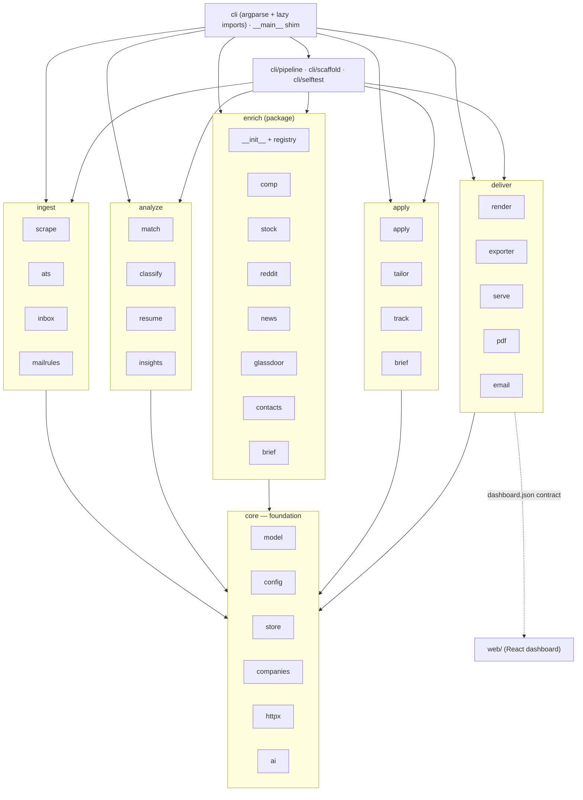
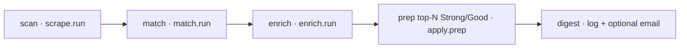
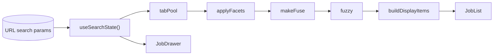
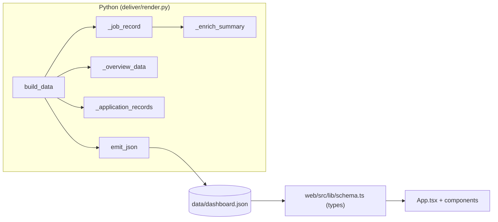

# jobscope — Architecture & Code Map

> A resume-driven job scout, enricher, and application-prep tool.
> **Deterministic-first, offline-first, AI-optional** — the core 80% (scoring, filtering,
> parsing, persistence) runs with no network and no API key; AI and network calls are
> optional upgrades that degrade gracefully.

This document is the living map of the codebase: what each module does, how they depend
on each other, the Python↔TypeScript data contract, and the modular sub-package
structure the codebase has settled into. Keep it current (see
[Keeping this doc current](#keeping-this-doc-current)).

---

## 1. Design philosophy

| Principle | What it means in code |
|-----------|-----------------------|
| **Deterministic-first** | `match`, `resume`, `mailrules`, `companies` are pure functions — no network, no LLM. Same input → same output. |
| **Offline-first** | Base layers have zero third-party network deps; scrapers/enrichers are best-effort and never break a run. |
| **AI-optional** | `ai.chat()` returns `None` when disabled; every AI caller (`classify`, `tailor`, `enrich/brief`) has a deterministic fallback. |
| **Additive persistence** | `store` upgrades old databases in place via `ALTER TABLE ADD COLUMN`; never a destructive migration. |
| **Best-effort enrichment** | Each enrich source is isolated; one failure is caught and does not stop the others. |

---

## 2. Repository layout

```
jobscope/
  jobscope/          Python package (the CLI + all logic)
    core/            Foundation: model, config, store/ (pkg), companies, httpx, ai
    ingest/          Acquire jobs & signals: scrape, ats, inbox, mailrules
    analyze/         Deterministic core: match/ (pkg), classify, resume, insights
    enrich/          Best-effort intel (one module per source) + registry
    apply/           Tailor & submit: apply, tailor, track, brief
    deliver/         Dashboards & exports: render, exporter, serve, pdf, email, schema/
    cli/             build_parser + cmd_* + main (+ pipeline, scaffold, selftest)
    __main__.py      Thin shim → cli.main (console-script + `python -m jobscope`)
  web/               Vite + React + TS dashboard (consumes the JSON contract)
    src/
  tests/             pytest suite (offline; mirrors the module layout)
  data/              Runtime artifacts (SQLite db, dashboard json) — gitignored
  ARCHITECTURE.md    This file
  pyproject.toml     setuptools; console-script `jobscope`; find = ["jobscope*"]
```

---

## 3. Layered architecture

Modules live in concern sub-packages under `jobscope/` (`core`, `ingest`, `analyze`,
`enrich`, `apply`, `deliver`, `cli`); each group below is a real package on disk (see
[§2](#2-repository-layout)). This layered shape is the one the reorg landed on (see
[Modularity roadmap](#12-modularity-roadmap)).



**Purely dependency-free modules** (no internal imports — the stable bedrock):
`model`, `config`, `companies`, `httpx`, `mailrules`, plus the leaf enrich sources
(`comp`, `stock`, `reddit`, `news`, `glassdoor`). `store` depends only on `model`;
`ai` only on `config`. **No circular imports exist anywhere.**

---

## 4. Backend module inventory

LOC are exact (source lines incl. comments). Grouped by concern (= sub-package on disk).

### core — foundation (pure/near-pure, highest fan-in)

| Module | LOC | Responsibility | Internal imports | Key exports |
|--------|-----|----------------|------------------|-------------|
| [model.py](jobscope/core/model.py) | 228 | Core dataclasses + id/slug helpers | — | `Job`, `Resume`, `Application`, `Contact`, `MailEvent`, `job_id()`, `slugify()`, `derive_remote_scope()` |
| [config.py](jobscope/core/config.py) | 176 | Load YAML/JSON, deep-merge over `DEFAULT_CONFIG`, env-only secrets | — | `DEFAULT_CONFIG`, `load_config()`, `api_key()`, `smtp_password()`, `inbox_password()` |
| [store/](jobscope/core/store/) | 527 | **Package** — SQLite persistence (10 tables) + additive migrations, split into `base` + `jobs`/`enrichment`/`applications`/`mail`/`profile`/`meta` mixins behind a `Store` facade | model | `Store`, `now_iso()` |
| [companies.py](jobscope/core/companies.py) | 128 | Curated prestige/size/funding tiers (deterministic) | — | `company_quality()`, `company_size()`, `company_funding()` |
| [httpx.py](jobscope/core/httpx.py) | 37 | Thin `requests` wrapper (UA, timeout, JSON) | — | `get()`, `get_json()`, `get_text()` |
| [ai.py](jobscope/core/ai.py) | 82 | OpenAI-compatible chat (Groq/Ollama); optional | config | `available()`, `chat()` |

### ingest — acquire jobs & signals

| Module | LOC | Responsibility | Internal imports | Key exports |
|--------|-----|----------------|------------------|-------------|
| [scrape.py](jobscope/ingest/scrape.py) | 153 | JobSpy + ATS boards → `Job` upserts (per-term isolation) | model, store | `run()`, `_row_to_job()` |
| [ats.py](jobscope/ingest/ats.py) | 213 | Direct Greenhouse/Lever/Ashby board fetch | httpx, model, store | `fetch_company()`, `run()` |
| [inbox.py](jobscope/ingest/inbox.py) | 283 | Gmail IMAP sync (read-only, incremental) → classify → `mail_events` → advance funnel | ats, config, model, store, mailrules | `run()` |
| [mailrules.py](jobscope/ingest/mailrules.py) | 340 | Deterministic email classification + company/role parsing (pure, no I/O) | — | `classify_signal()`, `is_job_related()`, `parse_company_role()`, `signal_to_status()`, `advance_status()`, `normalize_company()` |

### analyze — the deterministic core

| Module | LOC | Responsibility | Internal imports | Key exports |
|--------|-----|----------------|------------------|-------------|
| [match/](jobscope/analyze/match/) | 670 | **Package** — transparent fit scoring, tiers, filters, resume routing; split into `seniority`/`experience`/`filters`/`scoring`/`routing`/`run` submodules (all public + private names re-exported) | model, resume, (companies lazy) | `score_job()`, `apply_filters()`, `select_base()`, `run()`, `SENIORITY_RANK` |
| [classify.py](jobscope/analyze/classify.py) | 60 | Optional AI seniority + discipline tie-breaker | ai, match, model | `classify_seniority()` |
| [resume.py](jobscope/analyze/resume.py) | 339 | Parse Markdown/JSON-Resume/PDF/text → `Resume` + skills | match, model | `import_resume()`, `parse_resume()`, `SKILL_LEXICON` |
| [insights.py](jobscope/analyze/insights.py) | 47 | Skill-gap analysis across matched jobs | resume, store | `skill_gap()`, `run()` |

### enrich — best-effort public intel (`enrich/` package)

| Module | LOC | Responsibility | Internal imports |
|--------|-----|----------------|------------------|
| [enrich/__init__.py](jobscope/enrich/__init__.py) | 78 | Per-company coordinator — iterates the source registry (toggles each by config) | registry, comp, stock, reddit, news, glassdoor, brief, contacts |
| [enrich/registry.py](jobscope/enrich/registry.py) | 60 | Source registry + `@source(...)` decorator; sources self-register at import | — |
| [enrich/stock.py](jobscope/enrich/stock.py) | 130 | Stock / IPO lookup (Yahoo, keyless) + 52wk position | httpx |
| [enrich/brief.py](jobscope/enrich/brief.py) | 84 | Risk-forward company brief (deterministic + optional AI) | ai, match |
| [enrich/contacts.py](jobscope/enrich/contacts.py) | 81 | Referral-lead discovery (search links + GitHub) | model, httpx |
| [enrich/reddit.py](jobscope/enrich/reddit.py) | 60 | Reddit sentiment (lexicon-based) | httpx |
| [enrich/news.py](jobscope/enrich/news.py) | 50 | Google News RSS + optional custom feeds | — |
| [enrich/comp.py](jobscope/enrich/comp.py) | 42 | Compensation (posting salary + Levels.fyi links) | — |
| [enrich/glassdoor.py](jobscope/enrich/glassdoor.py) | 27 | Glassdoor rating (defensive) | httpx |

### apply — tailor & submit

| Module | LOC | Responsibility | Internal imports | Key exports |
|--------|-----|----------------|------------------|-------------|
| [apply.py](jobscope/apply/apply.py) | 245 | Prep package + human-in-loop ATS autofill (Playwright) | ai, email, tailor, model, store | `prep()`, `apply()` |
| [tailor.py](jobscope/apply/tailor.py) | 191 | Per-job resume + cover tailoring (deterministic + AI rewrite) | ai, pdf, model, resume, store | `run()`, `analyze()` |
| [track.py](jobscope/apply/track.py) | 114 | Application funnel, status, follow-up reminders | model, store | `run()`, `run_new()` |
| [brief.py](jobscope/apply/brief.py) | 21 | Thin CLI wrapper → `enrich.brief.build()` | enrich.brief | `run()` |

### deliver — dashboards & exports

| Module | LOC | Responsibility | Internal imports | Key exports |
|--------|-----|----------------|------------------|-------------|
| [render.py](jobscope/deliver/render.py) | 749 | Legacy local HTML dashboard (job buckets + overview) **+** the JSON data contract — incl. the **Applications** board data (pipeline + kanban + email timelines) now consumed by the React app | companies, store | `build()`, `build_data()`, `emit_json()`, `_application_records()` |
| [pdf.py](jobscope/deliver/pdf.py) | 66 | Markdown → HTML → PDF (Playwright; degrades gracefully) | — | `markdown_to_html()`, `render_pdf()` |
| [email.py](jobscope/deliver/email.py) | 36 | SMTP summaries (optional) | config | `send()` |
| [serve.py](jobscope/deliver/serve.py) | 27 | Local HTTP server for the dashboard | render, store | `run()` |
| [exporter.py](jobscope/deliver/exporter.py) | 22 | Export ranked jobs to JSON/CSV | — | `run()` |

Plus [schema/dashboard.schema.json](jobscope/deliver/schema/dashboard.schema.json) — the JSON-Schema
artifact for the emitted `dashboard.json`, cross-checked by [tests/test_dashboard_json.py](tests/test_dashboard_json.py).

> **Note:** the bulk of `render.py` (~852 lines, now at [deliver/render.py](jobscope/deliver/render.py))
> is the inline HTML `_TEMPLATE` string — the **local** self-contained dashboard (`jobscope dashboard`),
> still the **only** UI with the **Applications board** (kanban + per-application email timelines) and the
> inline-SVG **pipeline-flow Sankey**; the React app hasn't mirrored these yet. The **published** (public)
> dashboard is now the React app in `web/`, built from the redacted emitter. The data-contract logic
> (`build_data`/`_job_record`/`_application_records`/`_enrich_summary`/`_overview_data`/`emit_json`) is
> the remainder, and the emitted `dashboard.json` is pinned by a JSON-Schema artifact + a contract test
> (§9). Once the web app supersedes the HTML page, the template can shrink and `render.py` becomes a
> slim emitter.

### cli / orchestration

| Module | LOC | Responsibility | Internal imports | Key exports |
|--------|-----|----------------|------------------|-------------|
| [cli/__init__.py](jobscope/cli/__init__.py) | 195 | argparse dispatch for 18 subcommands — `build_parser` + all `cmd_*` + `main` (lazy per-command imports) | ~all (lazy) | `main()`, `build_parser()` |
| [pipeline.py](jobscope/cli/pipeline.py) | 46 | One-shot `scan → match → enrich → prep → digest` | apply, email, enrich, match, scrape | `run()` |
| [selftest.py](jobscope/cli/selftest.py) | 229 | Offline self-tests (validate the full stack, no network) | model, config, store, match, mailrules, ats, inbox | `run()` |
| [scaffold.py](jobscope/cli/scaffold.py) | 50 | `init`: scaffold config + data dir (non-destructive) | config | `run()` |
| [__main__.py](jobscope/__main__.py) | 9 | Thin entry-point shim at the package root (`from .cli import main`) | cli | `main` (re-exported) |
| [__init__.py](jobscope/__init__.py) | 6 | Package marker, `__version__` | — | `__version__` |

**Totals:** ~56 Python modules across 8 sub-packages (incl. the `store/` and `match/` sub-packages and
9 enrich modules) ≈ **6,000 LOC** of Python.

---

## 5. Coupling hotspots

Fan-in = how many modules import it; fan-out = how many it imports (internal only).

| Module | LOC | Fan-in | Fan-out | Read |
|--------|-----|:------:|:-------:|------|
| **core/store/** | 527 | ~11 | 1 | Every command persists through it. **Split done (P-D):** `base` + `jobs`/`enrichment`/`applications`/`mail`/`profile`/`meta` mixins behind a `Store` facade — same public API, one shared connection. |
| **core/model.py** | 228 | ~12 | 0 | Highest fan-in but **pure** — the ideal shape. Leave as-is. |
| **analyze/match/** | 670 | ~6 | 3 | Largest logic area. **Split done (P-E):** `seniority`/`experience`/`filters`/`scoring`/`routing`/`run` submodules, layered so leaves never import up; scores identical, all names re-exported. |
| **deliver/render.py** | 852 | 2 | 2 | Big only because of the inline HTML template (~850 lines of `_TEMPLATE`); the emitter is small. Shrinks once the HTML page retires. |
| **cli/__init__.py** | 195 | 0 | ~18 | Orchestrator (`build_parser` + `cmd_*` + `main`); wide fan-out but **lazy imports** keep startup light. Healthy. |
| **core/config.py** | 176 | ~6 | 0 | Pure config layer. Healthy. |
| **enrich/__init__.py** | 78 | 2 | 8 | Coordinator that **iterates the source registry** (P-B done); sources self-register via `@source(...)`. Healthy. |
| **core/ai.py** | 82 | ~4 | 1 | Optional layer; all callers have deterministic fallbacks. Healthy. |

---

## 6. Runtime flows

### CLI dispatch (`cli/__init__.py`)

The root [__main__.py](jobscope/__main__.py) is a thin shim (`from .cli import main`); the parser and
commands live in [cli/__init__.py](jobscope/cli/__init__.py). `build_parser()` defines one `argparse`
parser with subparsers; each subcommand does `set_defaults(func=cmd_<name>)`, and `main()` calls
`args.func(args, cfg)` inside a `Store` context manager. **Feature modules are imported lazily inside
each `cmd_*`** so the base CLI stays offline-friendly.

18 subcommands: `init`, `resume import`, `scan`, `match`, `pipeline`, `enrich`, `tailor`,
`prep`, `apply`, `dashboard`, `serve`, `track`, `inbox`, `new`, `gaps`, `brief`, `export`,
`selftest`.

### Pipeline (`pipeline.run`)



Stages communicate **only through the store** (no shared in-memory state), which keeps each
stage independently runnable from its own subcommand.

---

## 7. Persistence model (`core/store/`)

A single `Store` **facade** over SQLite, composed from per-concern mixins (`base` + `jobs`/
`enrichment`/`applications`/`mail`/`profile`/`meta`) over one shared connection. **10 tables**: `jobs`,
`enrichment`, `contacts`,
`applications`, `profile`, `resumes`, `meta`, `ai_cache`, `runs`, `mail_events`.

**Migration pattern** — `_ensure_columns()` reads `PRAGMA table_info(...)` and issues
`ALTER TABLE ... ADD COLUMN` for any missing field. New columns (e.g. `resume_base`,
`remote_scope`, `ai_seniority`, `brief_json`) were all added this way, so older databases
upgrade silently and older code ignores unknown columns.

Representative API: `upsert_job()`, `update_score()`, `update_ai_seniority()`, `jobs()`,
`get_job()`, `save_enrichment()`, `get_enrichment()`, `save_contacts()`, `contacts_for()`,
`set_application()`, `applications()`, `get_application()`, `upsert_mail_event()`, `mail_events()`,
`ai_cache_get/put()`, `log_run()`.

---

## 8. Web dashboard (`web/`)

Vite + React 19 + TS + Tailwind v4 + TanStack Router (hash) + Motion. The build bakes in
[web/src/data/dashboard.json](web/src/data/dashboard.json) (emitted by `jobscope dashboard --emit-json`).

| Area | Files | Responsibility |
|------|-------|----------------|
| **Entry** | [main.tsx](web/src/main.tsx), [router.tsx](web/src/router.tsx), [App.tsx](web/src/App.tsx) | Mount; hash route `/` with zod-validated search params; wire filters→search→display |
| **Data** | [data/index.ts](web/src/data/index.ts) | Static import of `dashboard.json` typed as `DashboardData` |
| **Contract** | [lib/schema.ts](web/src/lib/schema.ts) | TS mirror of the Python payload (keep 1:1) |
| **State** | [lib/urlState.ts](web/src/lib/urlState.ts), [hooks/useSearchState.ts](web/src/hooks/useSearchState.ts) | URL = single source of truth; `FACETS`, `searchSchema`, `TAB_VALUES` |
| **Filter/search** | [lib/filters.ts](web/src/lib/filters.ts), [lib/search.ts](web/src/lib/search.ts), [lib/overview.ts](web/src/lib/overview.ts), [lib/format.ts](web/src/lib/format.ts) | `tabPool`→`applyFacets`→`makeFuse`→`fuzzy`→`buildDisplayItems`; Fuse.js; formatting |
| **Components** | `Header`, `Tabs`, `Switch`, `JobList`, `JobCard`, `JobDrawer`, `Kpis`, `filters/*`, `overview/*` | Virtualized list, deep-linkable drawer, facets, KPI/donut/bars |
| **Hooks** | [hooks/useTheme.ts](web/src/hooks/useTheme.ts) | Dark/light toggle |

**State pipeline** (all in `App.tsx`, driven by the URL):



---

## 9. The Python↔TypeScript data contract

This is the **highest-friction seam** in the codebase: a change on one side must be mirrored
by hand on the other.



`build_data(cfg, store, public)` → `{ generated, total, rows[], overview, applications[] }`;
`emit_json` writes it to `data/dashboard.json`. `_redact_public()` clears `contacts`,
`rationale`, `base`, `overview.funnel`, and `overview.targets` for the public build.

### Coupling seams (edit both sides together)

| # | Field / shape | Python source | TS sink | Risk |
|---|---------------|---------------|---------|------|
| 1 | `Tier` enum | `TIER_COLORS` keys + `job.tier` | `Tier`, `TIER_COLOR`, `--strong/good/stretch/skip` in `theme.css` | New/renamed tier breaks colors, filters, sort |
| 2 | `JobRow` fields (27) | `_job_record()` dict keys | `JobRow` interface | A renamed Python key silently becomes `undefined` in TS |
| 3 | `EnrichSummary` (nested) | `_enrich_summary()` | `EnrichSummary`/`StockSummary`/`CompSummary`/`RedditSummary`/`NewsItem` | Structural drift cascades |
| 4 | `Overview` | `_overview_data()` | `Overview` | `funnel`/`gaps`/`considered`/`targets` must line up |
| 5 | **`applications[]`** ✅ | `_application_records()` → `applications[]` (emitted **and** rendered in the HTML dashboard's Applications board) | `Application` + `ApplicationEvent` interfaces; `applications?` on `DashboardData` | **Closed** — the TS types exist and [tests/test_dashboard_json.py](tests/test_dashboard_json.py) guards the emitted shape; the React app can now mirror the HTML board |
| 6 | Facet keys | job fields (`base`,`country`,`place`,`remote`,`funding`,`remote_scope`) | `FACETS`, `FacetKey`, `searchSchema`, `FacetBar` | A new facet = 4 TS edits |
| 7 | Country/place values | `_country_of()`, `_place_of()` | displayed as-is | Grouping changes fragment facet options |
| 8 | Salary string | `_fmt_salary()` | `format.ts:compLabel()` | Python owns the format; TS cannot reparse |
| 9 | Stock/comp field pick | `_enrich_summary()` key subset | `format.ts:stockLabel()` | Added stock field invisible until schema updated |
| 10 | Public redaction | `_redact_public()` | no type-level public/private distinction | A missed field could leak private data |
| 11 | `gaps` tuple | `[[skill, count]]` | `[string, number][]` | Structural change breaks index access |

> **Mitigation (P-A · done):** a JSON-Schema artifact lives at
> [jobscope/deliver/schema/dashboard.schema.json](jobscope/deliver/schema/dashboard.schema.json) and a
> structural contract test ([tests/test_dashboard_json.py](tests/test_dashboard_json.py)) asserts the
> emitted `dashboard.json` matches the shape (and that the public build is redacted). *Opportunistic
> next:* generate `schema.ts` from Python so the mirror can't drift.

---

## 10. Extension recipes (how to add X today)

**Add a CLI subcommand:** write `cmd_<name>(args, cfg)` in [cli/__init__.py](jobscope/cli/__init__.py),
add a `sub.add_parser(...)` with `set_defaults(func=cmd_<name>)`, put logic in a feature module
(lazy-import it inside `cmd_<name>`).

**Add an enrichment source:** create `enrich/<src>.py` exposing `enrich(company, ...)` and decorate it
with `@source(section=..., config_key=...)` from [enrich/registry.py](jobscope/enrich/registry.py); add
the module to the import line in [enrich/__init__.py](jobscope/enrich/__init__.py) so its decorator runs
at import (import = register — no `if cfg[...]` ladder edit); add its toggle to the `enrich` section of
`DEFAULT_CONFIG` ([core/config.py](jobscope/core/config.py)); surface fields via `_enrich_summary` +
`schema.ts`.

**Add a `Job` field end-to-end:** add it to the `Job` dataclass ([model.py](jobscope/core/model.py)) →
add the column to `SCHEMA` + `_ensure_columns()` ([store/base.py](jobscope/core/store/base.py)) → set it
in `scrape`/`ats` → emit it in `_job_record` ([render.py](jobscope/deliver/render.py)) → add it to `JobRow`
  ([schema.ts](web/src/lib/schema.ts)) → use it in components.

**Add a web facet:** add the key to `FACETS`, `FacetKey`, and `searchSchema`
([urlState.ts](web/src/lib/urlState.ts)); render it in `FacetBar`; ensure the underlying field
is present on `JobRow`.

---

## 11. What's already healthy (leave alone)

- **No circular imports**; a clean acyclic dependency graph.
- **Pure bedrock** (`model`, `config`, `companies`, `httpx`, `mailrules`) — trivially testable.
- **Lazy CLI imports** keep startup fast and offline-friendly.
- **Additive migrations** — safe, reversible-by-omission schema evolution.
- **Isolated enrich sources** — best-effort, one failure never cascades.
- **Deterministic core with optional AI overlay** — respected consistently.

---

## 12. Modularity roadmap — shipped

The plan was **document now, refactor incrementally**. All three tiers have since landed; this
section is now a record of what shipped (plus the few genuinely-optional ideas left).

### Tier 1 — data-contract & config guards ✅ done

- **P-A · Data-contract SSOT — done.** The `applications[]` array is typed end-to-end:
  `Application` + `ApplicationEvent` interfaces and `applications?` on `DashboardData`
  ([web/src/lib/schema.ts](web/src/lib/schema.ts)); a JSON-Schema artifact
  ([jobscope/deliver/schema/dashboard.schema.json](jobscope/deliver/schema/dashboard.schema.json))
  and a structural contract test ([tests/test_dashboard_json.py](tests/test_dashboard_json.py))
  assert the emitted `dashboard.json` matches the shape and that the public build is redacted
  (seam #5 closed). *Invariant held:* the JSON shape stays identical.
- **P-B · Enrichment registry — done.** [enrich/__init__.py](jobscope/enrich/__init__.py) iterates
  `SECTION_SOURCES`; each source self-registers via the `@source(...)` decorator in
  [enrich/registry.py](jobscope/enrich/registry.py). A new intel source is one module + a decorator
  — the old `if cfg[...]` ladder is gone. *Invariant held:* each source stays independent and
  best-effort.
- **P-C · Config-drift guard — done.** [tests/test_config.py](tests/test_config.py) asserts
  `config.example.yaml` covers every `DEFAULT_CONFIG` key path. *Invariant held:* env-only secrets.

### Tier 2 — structural splits ✅ done

- **P-D · `store.py` → [core/store/](jobscope/core/store/) package — done.** `base` (connection +
  `SCHEMA` + additive `_ensure_columns`) plus `jobs`/`enrichment`/`applications`/`mail`/`profile`/
  `meta` mixins composed behind the `Store` facade. `from jobscope.core.store import Store` / `now_iso`
  unchanged; migrations still additive; same public method names.
- **P-E · `match.py` → [analyze/match/](jobscope/analyze/match/) package — done.**
  `seniority`/`experience`/`filters`/`scoring`/`routing`/`run` submodules, layered so leaves never
  import up. Scoring stays a pure, network-free function — identical scores; all public *and* private
  names are re-exported so tests/selftest are unchanged.

### Tier 3 — package reorganization ✅ done

The formerly-flat package is now grouped into concern sub-packages (§2/§3):

```
jobscope/
  core/      model, config, store/ (pkg), companies, httpx, ai
  ingest/    scrape, ats, inbox, mailrules
  analyze/   match/ (pkg), classify, resume, insights
  enrich/    sources + registry (already a package)
  apply/     apply, tailor, track, brief
  deliver/   render, exporter, serve, pdf, email, schema/
  cli/       build_parser + cmd_* + main (+ pipeline, scaffold, selftest)
  __main__.py  ← thin shim at the root: `from .cli import main`
```

The entry point stayed put — `pyproject.toml` maps `jobscope = "jobscope.__main__:main"` and
`python -m jobscope` both resolve to the root `__main__.py` shim. `[tool.setuptools.packages.find]
include = ["jobscope*"]` auto-discovers every sub-package (each has an `__init__.py`). Backend uses
relative imports (`from ..core.model import ...` across groups, `from .` within a group); tests use
absolute imports (`from jobscope.analyze.match import ...`). No compatibility shims — every call site
was updated.

### Opportunistic (optional, unscheduled)

- Split `resume.py` per-format parsers; split `tailor.py` (deterministic `analyze` vs AI rewrite);
  inline the thin [apply/brief.py](jobscope/apply/brief.py) wrapper.
- Retire `render.py`'s inline HTML `_TEMPLATE` once the React app mirrors the local-only Applications
  board + pipeline Sankey (the React app is already the **published** dashboard), leaving a slim emitter.
- Generate `schema.ts` from the Python shapes (or the JSON Schema) so the TS mirror can't drift.

**Invariants held across every tier:** deterministic-first, additive migrations, zero circular
imports; `pytest` + `jobscope selftest` + `npm run build` green.

---

## Keeping this doc current

Update this file when you:

- add/rename/move a module (§4 inventory) or change an import edge (§3/§5);
- change the emitted JSON shape — touch [render.py](jobscope/deliver/render.py) `build_data`/`_job_record`/
  `_enrich_summary`/`_overview_data` or [schema.ts](web/src/lib/schema.ts), and keep
  [deliver/schema/dashboard.schema.json](jobscope/deliver/schema/dashboard.schema.json) +
  [tests/test_dashboard_json.py](tests/test_dashboard_json.py) in step (§9 seam table);
- complete a roadmap item (§12) — move it to "shipped" and note the commit.

Consider adding a lightweight pointer to this file from the README. The JSON-Schema contract test
([tests/test_dashboard_json.py](tests/test_dashboard_json.py)) is the machine-checked half of §9.
